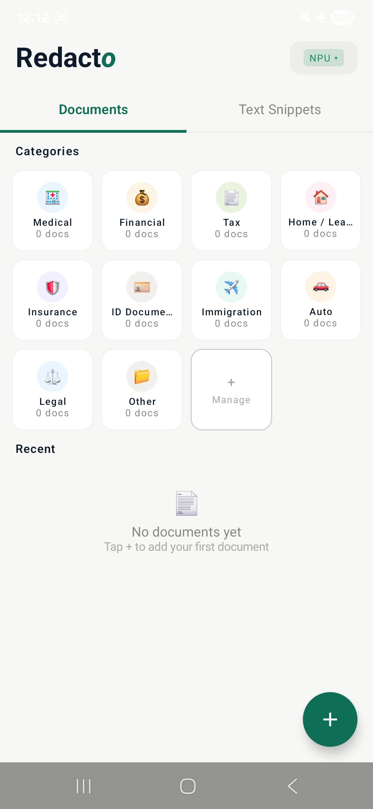
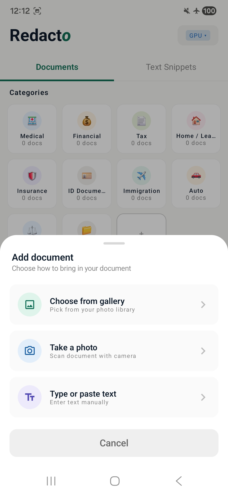
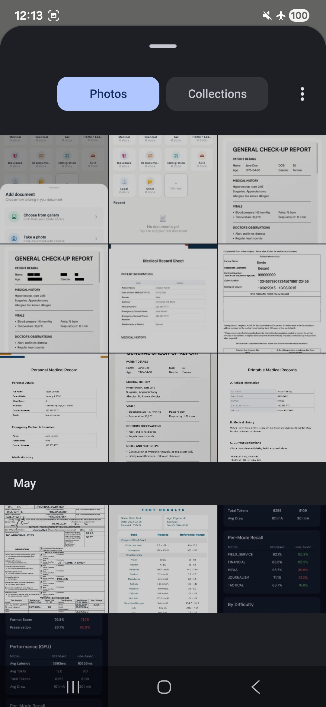
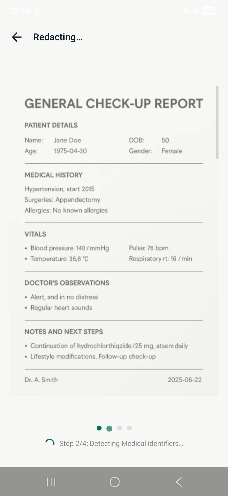
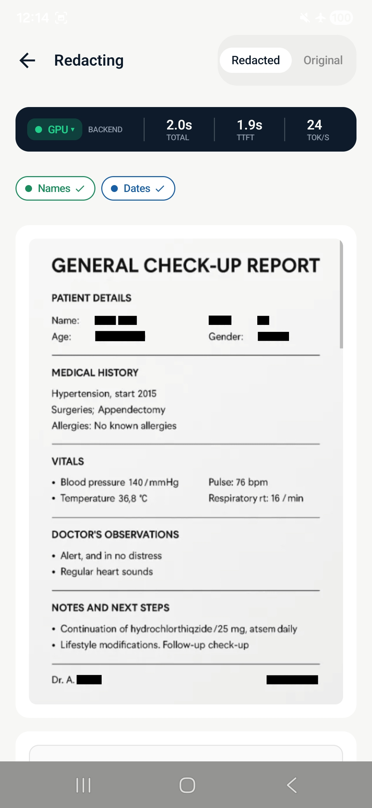
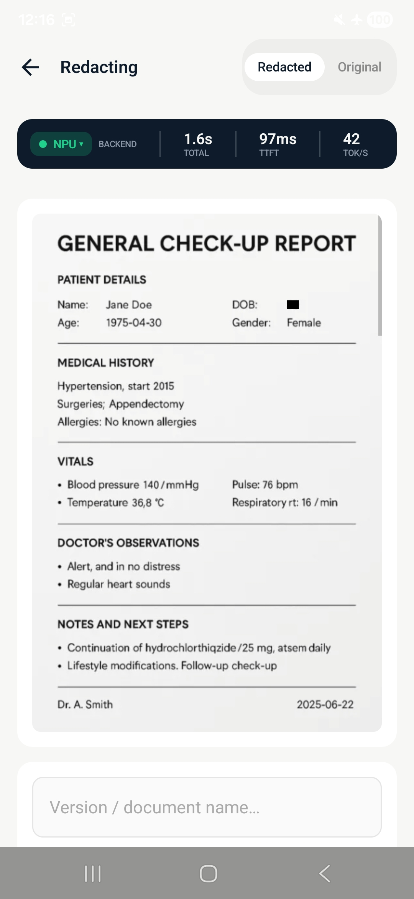
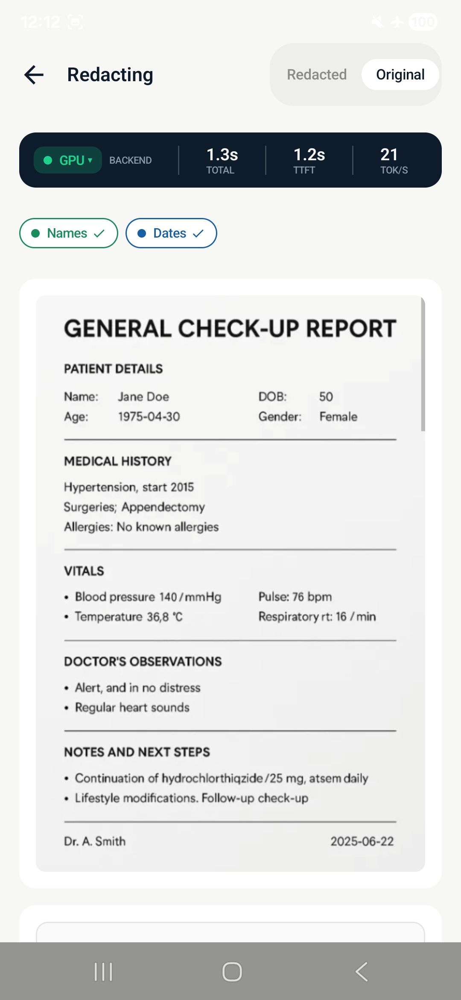
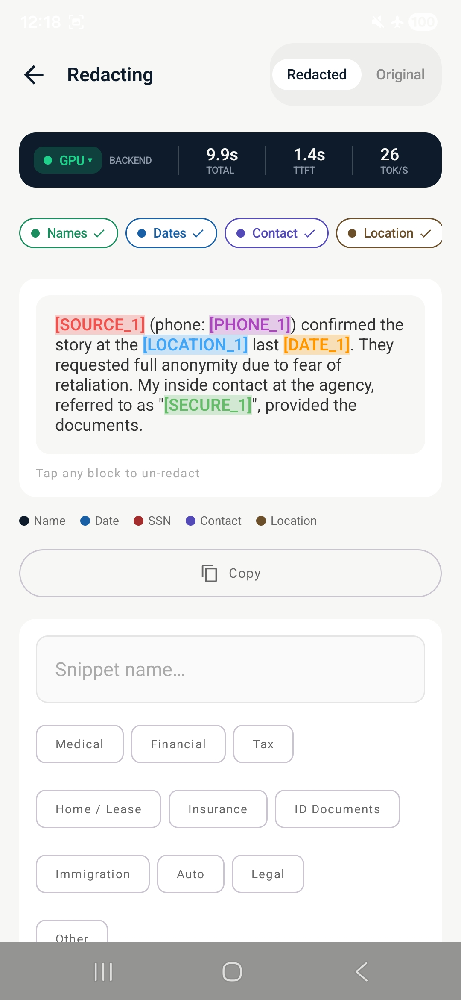
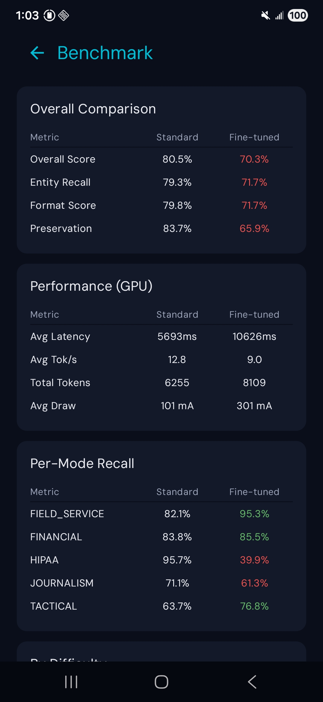

# Redacto — Privacy. Redacted.

**Zero-trust on-device redaction for any sensitive document.**
A privacy layer for Medical, Financial, Legal, Tactical, Journalism, Field Service, and General content — running entirely on a Samsung Galaxy S25 Ultra. No cloud calls. No `INTERNET` permission. No BAA required. All AI inference on-device via the LiteRT-LM compiled-model API on Snapdragon 8 Elite.

> Built for the **Qualcomm × Google LiteRT Developer Hackathon 2026** by team **Edge Artists**.

---

## Built for the brief

| ✓ | What | Detail |
|---|---|---|
| ✅ | **Track 1 fit** | LLM-based consumer journey · privacy by design |
| ✅ | **LiteRT-LM** | compiled-model API · Gemma 4 E2B (`.litertlm`) |
| ✅ | **Snapdragon 8 Elite** | Hexagon V79 NPU · QNN delegate · 41.7 tok/s sustained |
| ✅ | **Galaxy S25 Ultra** | target device · arm64 · 12 GB RAM · Android 15 |

---

## 60-second elevator pitch

> Healthcare is the canary. 6.4M home health workers break HIPAA daily — not out of negligence, but because the compliant tools are too slow for the field. *The same shadow-IT pattern repeats across finance, law, public safety, journalism, and field service.* One leaked text. Eight identifiers. Up to $1.9M in fines. Every existing solution encrypts the pipe. **Redacto sanitizes the content** — across seven domains, on-device, before a byte touches the network. No cloud. No BAA. No behavior change. Just tap Share, tap Redacto, tap Send.

| Beat | Idea |
|---|---|
| **The hook** | Good people breaking the rules out of necessity, every day — clinicians, advisors, attorneys, officers, reporters, technicians. The villain is the system, not the worker. |
| **The insight** | Everyone protects the pipe. We protect the content — structurally impossible to violate, regardless of channel. |
| **The tech edge** | Snapdragon NPU + quantized Gemma = sub-500ms contextual reasoning entirely offline. Regex can't touch this. |
| **The close** | Three taps. No friction. No behavior change required — the hardest problem in enterprise adoption, solved architecturally. |

---

## 01 · The problem — the 45-second compliance gap nobody has closed

Frontline professionals — clinicians, financial advisors, attorneys, first responders, journalists, field technicians — live in a world where compliant tools require VPN, a separate login, and a network connection. In the gaps between tasks, they do what every human does. They text. They paste. They send.

> "TigerConnect may not be appropriate for use in emergency situations." — *TigerConnect's own documentation*

The gap isn't between secure and insecure channels. The gap is between the moment sensitive content is created and the moment it leaves the device. Nobody has put intelligence in that gap — until now.

> **8 sensitive identifiers** in a single typical field message — same profile in finance, legal, public safety, journalism, field service.

### Example use case · 1 of 7 supported domains

**Maria, home health nurse.** 11 years · sees 8 patients/day · 3 counties.
She's in her car. 45 seconds until the next patient. The hospital app needs VPN. She opens iMessage instead and types what she always types:

> "Mrs. Chen (DOB 3/15/48, MRN 4471829) — left heel wound not improving, glucose 289, increased Lantus to 22u. Mentioned depression — need psych referral. Daughter Lisa (408-555-1234) wants updates."

**8 PHI identifiers · potential fine up to $1.9M per violation category.**

### The same 45-second gap, seven times over

Layer 1 (Classify) auto-detects the document's category and switches Layer 2's prompt to the matching specialist. Seven categories supported end-to-end in the pipeline:

| Category | Typical identifiers |
|---|---|
| 🏥 **Medical** | names, DOB, MRN, diagnoses |
| 🏦 **Financial** | accounts, routing, SSN, tax IDs |
| ⚖️ **Legal** | parties, case numbers, attorney contacts |
| 🚔 **Tactical** | victims, witnesses, minors |
| 📰 **Journalism** | source identity, locations |
| 🔧 **Field Service** | gate codes, PINs, customer PII |
| 🔲 **General** | names, dates, contacts, addresses (fallback) |

### Real data · real stakes

| Stat | Source |
|---|---|
| **$9.9M** OCR fines in 2024 — up 37% YoY | HIPAA Journal 2025 |
| **$7.4M** average healthcare breach cost — #1 costliest industry for 14 years | IBM Cost of Breach 2025 |
| **23%** clinicians using ChatGPT for documentation — no BAA, no compliance | Health system audit 2026 |
| **$116B** on-device AI market by 2033 — 27% CAGR | Grand View Research 2025 |

---

## 02 · Why existing solutions fail

Every competitor solves the wrong problem. They encrypt the channel. We sanitize the content. That is not a feature difference — it is a category difference.

| Competitor | What it does | The fatal flaw |
|---|---|---|
| **TigerConnect / Imprivata** *(secure messaging)* | Encrypted channel within an org. Safe pipe between enrolled users. | Both endpoints must be enrolled. Patients' families, pharmacies, outside agencies — none are. Requires internet. |
| **Cloud AI Redaction** *(API-based)* | Send text to a cloud endpoint, receive redacted text back. | PHI leaves the device the moment it hits the API. The violation already occurred before redaction. Structurally unfixable. |
| **Regex / NLP Tools** *(pattern matching)* | Fast, deterministic. Catches SSNs, phone numbers, emails. | "Lisa" is not PHI. "The patient's daughter Lisa" is. Relational context requires LLM reasoning. Regex is permanently blind to it. |
| **Shadow AI (ChatGPT)** *(consumer LLM)* | 23% of clinicians already use it. It understands context. It works. | PHI goes to OpenAI's servers. No BAA with a free product. The "smart" workaround is the worst compliance failure. |
| **HIPAA Training** *(policy / culture)* | Train nurses not to text PHI. Compliance culture. | Burnout, urgency, and 45-second windows always beat policy. You cannot train away the human condition. |

> **The architectural truth:** Redacto is the only solution where it is *physically impossible* for raw sensitive content to leave the device. Not policy. Not encryption. Not hoping the recipient is on the same platform. Data is sanitized in-memory before any network call can occur.

---

## 03 · The solution — before vs. after Redacto

| Without Redacto | With Redacto |
|---|---|
| 1. Maria finishes patient visit. Complex clinical picture. 45 seconds to the next appointment. | 1. Same visit. Same 45 seconds. She writes her note in Notes — exactly as she always has. |
| 2. Opens hospital's "compliant" app. VPN prompt. Slow on rural LTE. Switches to iMessage. | 2. Taps Share. Redacto is in the share sheet next to Messages. One tap. |
| 3. Types name, DOB, MRN, diagnoses, family contacts. Sends. Gets on with her day. | 3. On-device Gemma streams the first token in 92ms — full result in 2.78s on a 229-char clinical note. No network call. Heatmap shows what was caught and why. |
| 4. 8 PHI identifiers now live on an unencrypted server. Maria has no idea. The audit clock starts. | 4. Taps Messages. Clean text pre-fills compose. She sends. Fully compliant. Zero behavior change. |

---

## 04 · App flow — image-first, share-sheet native

The app opens to your document vault. Tap **+** to scan, photograph, or paste. Redacto runs its pipeline entirely on-device and returns a redacted result you can save or send.

| Step | Action |
|---|---|
| **01 · Capture** | Tap + on the home vault screen. Choose camera scan, gallery upload, or paste raw text. Any input format works. |
| **02 · OCR + Index** | ML Kit OCR extracts every word with its bounding box. Elements get a numeric index — no string matching, ever. |
| **03 · Redact** | 4-layer on-device pipeline: Classify → Detect → Redact → Validate. Black boxes drawn directly on the bitmap. |
| **04 · Save or send** | Result screen: redacted image + redacted text + confidence heatmap. Save to vault, copy text, or share via the OS share sheet. |

### Live screenshots — actual app, real device

| Screen | Image |
|---|---|
| **01 · Home** — document vault with category grid |  |
| **02 · Add** — gallery, camera, or paste text |  |
| **03 · Pick** — OS gallery picker |  |
| **04 · Pipeline** — Step 2/4 · Detecting Medical identifiers |  |
| **05 · Result · GPU** — 2.0s total · 1.9s TTFT · 24 tok/s |  |

### NPU vs GPU on the same document — live HUD

| Backend | Total | TTFT | tok/s | Screenshot |
|---|---|---|---|---|
| GPU | 2.0s | 1.9s | 24 |  |
| **NPU** | **1.6s** | **97ms** | **42** |  |

The same general check-up report. The same 4-layer pipeline. The same on-device model. Backend swap delivers the speedup the benchmarks promised.

### Tap-to-un-redact + text mode

| Feature | Image |
|---|---|
| **Toggle** — flip between Redacted and Original views; tap individual blocks to selectively reveal |  |
| **Text · Journalism** — plain text input, color-coded category placeholders, save as snippet |  |

---

## 05 · 4-layer pipeline architecture

A single LLM call asked to simultaneously classify, detect, replace, and verify produces inconsistent results. Redacto separates concerns — each layer runs a **fresh conversation** with a purpose-built prompt.

### Layer 01 · Classify
Document type + category detection. The LLM reads the input and determines what kind of document it is and which regulatory category applies. This single decision shapes every subsequent prompt — wrong classification means wrong redaction rules. Output drives which of the 7 specialist detectors runs in Layer 2.

```
DOCUMENT_TYPE: Medical Note
CATEGORY: Medical
```

### Layer 02 · Detect
Find every identifier — including relational ones. Each category has a hand-crafted prompt that explicitly names what to find (NAME, DOB, MRN, PHONE…) and what to preserve (diagnoses, medications, lab values, ages under 90). The LLM finds relational identifiers that regex never could: *"the patient's daughter Lisa"* — "Lisa" in isolation isn't PHI; in context, it is.

```
NAME: Mrs. Chen
DATE: 3/15/48
MRN:  4471829
PHONE: 408-555-1234
```

For images, the LLM labels indices, not strings: `1:NAME 2:NAME 5:DATE`.

### Layer 03 · Redact
OCR is imperfect. The LLM detects `inquire@ucal.com` but the raw OCR text says `inquire@blucurrent.mail`. A deterministic `string.replace()` silently fails — the identifier slips through untouched. **Layer 3 uses the LLM to perform the substitution**, so OCR errors in detection never produce missed redactions.

For images, detected index ranges map directly to bounding boxes — black rectangles are drawn on the bitmap. **No string matching involved.**

### Layer 04 · Validate
A completely fresh LLM conversation reads the redacted output and asks one question: did any plain-text identifier survive? The auditor has **no memory** of what Layers 1–3 decided — it can't be anchored to their assumptions.

If it finds a miss, it extracts the leaked items and triggers a re-run of Layers 3 + 4. **Maximum 3 rounds** (initial + 2 retries). After three clean passes, the result is returned. This is why Redacto catches what single-pass systems miss.

### Image redaction · indexed-element approach

```
OCR (indexed)        →  LLM labels (Layer 2)  →  Layer 3 draws boxes
[0] Patient              1:NAME                   Patient ████ ████
[1] Jane                 2:NAME                   DOB: ████
[2] Smith                4:DATE                   compound fracture
[3] DOB:                 0,3,5,6:preserve
[4] 03/15/78
[5] compound
[6] fracture
```

**Why we index instead of string-match:** the index → bounding-box mapping is lossless. No text matching means no OCR-error sensitivity. HUD field count and visual box count are always consistent.

---

## 06 · Why this can't be easily copied

| # | Moat |
|---|---|
| **01** | **Zero-trust by architecture** — On-device inference is not a UX choice. It's the only architecture where sensitive data is *physically incapable* of leaving the device. No cloud competitor can claim this. By definition. |
| **02** | **Channel-agnostic output** — Redacted text works on Messages, WhatsApp, Slack, Email — any channel. You don't onboard recipients. You sanitize, then send anywhere. TigerConnect requires both ends on the platform. |
| **03** | **Relational LLM reasoning** — "Lisa" is not PHI. "The patient's daughter Lisa" is. This relational disambiguation requires semantic reasoning — exactly what quantized Gemma on the Snapdragon NPU delivers at sub-500ms. |
| **04** | **No BAA required** — No third-party processor = no Business Associate Agreement needed. Every cloud redaction tool requires weeks of legal review. Redacto removes an entire compliance layer — structurally, not by policy. |

> **10-second pitch:** "Every other solution protects the pipe. We protect what goes through it — before it goes anywhere. Every channel is safe, it works offline, and requires no agreement from the recipient. No competitor can claim all three."

---

## 07 · Technical stack — built on the Snapdragon 8 Elite

| Layer | Component | What it does |
|---|---|---|
| Pipeline · Layers 1–4 | **LiteRT-LM + Gemma 4 E2B** | Quantized Gemma running on-device via the LiteRT-LM compiled-model API. Catches relational identifiers and contextual references that regex can't touch — "Lisa" alone isn't PHI, "the patient's daughter Lisa" is. |
| Silicon · NPU | **Snapdragon Hexagon NPU** | Qualcomm QNN delegates targeting Hexagon V79 directly. Measured 41.7 tok/s sustained decode on Gemma 4 E2B — entirely offline. |
| Vision · OCR | **Google ML Kit OCR** | On-device text recognition from photos, charts, prescriptions, IDs, handwritten notes — with full bounding-box metadata. |
| UI · Android | **Jetpack Compose** | Native Android UI: document vault home, camera scanner, confidence heatmap overlay, share sheet integration. |
| Device · Target | **Samsung S25 Ultra** | Snapdragon 8 Elite (SM8750), 12 GB RAM, Android 15. NPU path via `libLiteRtDispatch_Qualcomm.so`. GPU fallback via OpenCL. |

| Metric | Value |
|---|---|
| **41.7 tok/s** | sustained on NPU · Gemma 4 E2B |
| **0** | bytes of sensitive content ever leaving the device |
| **92ms** | time-to-first-token on NPU · 4× faster than GPU |
| **100%** | offline — works in airplane mode, no `INTERNET` permission |

### Code & model optimization for Snapdragon 8 Elite — 10 deliberate decisions

| # | Optimization | Detail |
|---|---|---|
| **01** | **INT4-quantized Gemma 4 E2B via LiteRT-LM** | Two compiled bundles: `gemma4.litertlm` (2.4 GB · GPU/CPU) and `gemma4_npu.litertlm` (2.8 GB · QNN-prepared for Hexagon). Both use the LiteRT-LM compiled-model API. |
| **02** | **QNN delegate via Qualcomm dispatch library** | NPU path through `libLiteRtDispatch_Qualcomm.so`. Targets Hexagon V79 directly — no CPU fall-through during decode. |
| **03** | **AOT cache for cold-start** | Compiled NPU graph cached to `context.cacheDir`. Second-launch init drops from ~14s to under 2s. |
| **04** | **Backend cascade · NPU → GPU → CPU** | Cascade lives in `RedactionViewModel`, looping over `engine.initialize(...)` per backend (each variant pairs with its own model file). Necessary because `Backend.NPU()` construction succeeds even without the dispatch library — failure surfaces at init. |
| **05** | **4-pass pipeline · separation of concerns** | Classify → Detect → Redact → Validate. Each LLM call is a fresh conversation — purpose-built prompt, no context pollution. Beats single-pass on accuracy. |
| **06** | **Indexed-element image redaction** | OCR yields indexed tokens; LLM returns indices, not strings. Index → bounding-box mapping is lossless. Zero string-matching overhead and zero OCR-error sensitivity. |
| **07** | **Constrained sampling (GPU) · streaming (NPU)** | GPU path uses `topK=64, topP=0.95` for compact output. NPU path streams via QNN's native sampling. The tradeoff is documented transparently in the benchmarks section. |
| **08** | **arm64-v8a single-ABI build** | No fat APK. `packaging.jniLibs.pickFirsts` dedupes `libQnnCpu.so`, `libQnnHtp.so` across QNN AARs. Slim, clean install. |
| **09** | **largeHeap + chunked OCR (150 elements)** | Required for the 2.4 GB resident model + tensor buffers. Long documents chunked at 150 elements per detection pass to respect the ~4k context window. |
| **10** | **No `INTERNET` permission · zero telemetry** | The manifest cannot send a packet. Compliance is structural, not a setting. ML Kit telemetry uses cached background jobs, not runtime calls. |

---

## 08 · Engineering journey

Every section above describes what shipped. This section describes what we tried, what broke, and what we're explicit about not having reached alone.

### From single-pass to 4-layer

| v1 · ShieldText fork | → | v2 · Redacto |
|---|---|---|
| Single-pass · regex fallback | | 4-layer pipeline · indexed images · validator |
| One LLM call: classify + detect + redact in a single prompt | | Classify → Detect → Redact → Validate · each a fresh conversation |
| Deterministic `string.replace()` on the LLM's detection output | | LLM-driven substitution — handles OCR noise the model auto-corrects |
| Regex fallback for SSN / phone / email patterns | | Indexed-element image redaction — zero string matching |
| No validator — whatever the model produced shipped | | Independent auditor with up to 3 retry rounds |

### What we tried · what shipped · why

| Idea | Outcome | What we learned |
|---|---|---|
| Fine-tune Gemma 4 E2B on the redaction dataset | ⛔ **Cannot ship to NPU** | Trained successfully on GPU. Quality regressed (70.3% vs 80.5%) and — more critically — couldn't be compiled into a `_qualcomm_sm8750.litertlm` bundle without QNN's internal toolchain. See blocker note below. |
| Single-pass redaction (v1 inheritance) | 🔁 Replaced | One LLM call asked to classify, detect, redact, and verify. Inconsistent. Splitting into 4 fresh conversations beat it on every accuracy metric. |
| Deterministic `string.replace()` in Step 3 | 🔁 Replaced | OCR text had errors. The LLM "corrected" them in detection output. Exact strings stopped matching the source — 6 of 8 redactions silently dropped. Step 3 became an LLM call. |
| Word-diff heuristic for image bounding boxes | 🔁 Replaced | LLM rewrote text — diff-based bbox lookup broke. Indexed-element approach is now lossless: the LLM returns indices, we map directly to bounding boxes. |
| PDF upload (PdfRenderer + ML Kit) | ✂ Cut from demo | Built end-to-end, not exhaustively tested. Demo risk outweighed feature value. Code is shipped, gated — see Future enhancements. |
| Battery / energy metrics | ⛔ Dropped | `BatteryManager.BATTERY_PROPERTY_CURRENT_NOW` is system-wide, sampled at 1Hz. Two readings can't isolate per-process draw. We don't fake numbers — so we removed it. |
| RegexFallback safety net | ⛔ Removed | Inherited from v1 ShieldText. Multi-pass + validator covers the safety case more thoroughly. LLM-only is the cleaner architectural story. |
| NPU re-init within same process | ⚠ Known limitation | QNN holds DSP state across `Engine.close()`. Switching backends mid-session crashes. Documented; recoverable only by app restart. |
| Constrained sampling on NPU (topK / topP) | ⚠ QNN-side limitation | QNN returns "not supported, error 12". `SamplerConfig = null` on NPU. Consequence: NPU output is more verbose. We surface this honestly in the benchmarks. |

### Receipts — the v1 ShieldText benchmark screen



Captured live from the v1 ShieldText benchmark screen. Overall score collapsed **80.5% → 70.3%**; HIPAA recall fell **95.7% → 39.9%**; preservation dropped **83.7% → 65.9%**. Field service and tactical improved, but the average regressed. We have the artifact — what we don't have is the QNN AOT toolchain to ship it to NPU and re-evaluate after Qualcomm's quantization.

### ⛔ The blocker we couldn't break alone — NPU-prepared fine-tuned models

We have a fine-tuned Gemma 4 E2B specialized on the redaction task. It runs on GPU. We **cannot** ship it to the Hexagon V79 NPU. Compiling a fine-tuned `.litertlm` into a Qualcomm-prepared `_qualcomm_sm8750.litertlm` bundle requires the QNN graph-compilation pipeline — AIMET quantization plus Qualcomm's internal AOT conversion toolchain. That is not part of the public LiteRT-LM SDK.

NPU runs the stock `gemma-4-E2B-it_qualcomm_sm8750.litertlm` bundle published by `litert-community`. With Qualcomm hardware-team support to QNN-compile our fine-tuned bundle, we expect domain-specific accuracy gains and a smaller compiled binary. **This is a hardware-team integration boundary — not an engineering shortcut.**

---

## 09 · Benchmarks — measured, not marketed

Every number below is from a verified run on a Galaxy S25 Ultra — 30 entries across 5 redaction modes.

### Setup

| Field | Value |
|---|---|
| Device | Galaxy S25 Ultra · Snapdragon 8 Elite · SM8750 |
| Model | Gemma 4 E2B · 2.4 GB GPU · 2.8 GB NPU |
| Pipeline | 3-step · Classify · Detect · Redact |
| Dataset | 30 entries · 5 modes · easy difficulty |

### Headline numbers · NPU vs GPU

| Metric | Detail |
|---|---|
| **4.0× faster TTFT** | 92ms first-token on NPU vs 366ms on GPU — your user feels the redaction before they finish reading the loading message. |
| **1.7× faster decode** | 41.7 tok/s on NPU vs 24.5 tok/s on GPU — the only delegate that hits real-time speed on Gemma 4 E2B. |
| **2.5× faster Detect** | 624ms vs 1,586ms — the costliest stage of the pipeline collapses on the Hexagon V79 NPU. |
| **2.0× end-to-end (short docs)** | 2.78s NPU vs 5.65s GPU on a 229-char clinical note — the typical mobile interaction. |

### Per-step latency · 30-entry average

| Step | GPU | NPU | Note |
|---|---|---|---|
| Step 1 · Classify | 773ms | 345ms | **2.2× faster** on NPU |
| Step 2 · Detect | 1,586ms | 624ms | **2.5× faster** on NPU |
| Step 3 · Redact | 2,475ms | 4,060ms | NPU verbose · 3.2× more tokens |

### Time to first token (lower is better)

| Step | GPU | NPU |
|---|---|---|
| Step 1 | 381ms | **99ms** |
| Step 2 | 375ms | **104ms** |
| Step 3 | 366ms | **92ms** |

### Decode throughput (higher is better)

| Step | GPU tok/s | NPU tok/s |
|---|---|---|
| Step 1 | 25.3 | **41.7** |
| Step 2 | 24.9 | **41.7** |
| Step 3 | 24.5 | **41.7** |

### Peak resident memory

| Backend | Peak RSS |
|---|---|
| GPU | 1,375 MB |
| NPU | 1,934 MB |

NPU costs ~560 MB more — model file is 2.8 GB vs 2.4 GB, plus QNN runtime buffers. Both fit comfortably in S25's 12 GB RAM.

### ⚖ Why total wall-clock isn't 2× — the honest tradeoff

The NPU is faster *per token*, but **QNN doesn't yet support constrained decoding** — so we can't cap output length the way GPU does (`topK=64, topP=0.95`). The NPU's unconstrained sampling produces ~2× more tokens, which equalizes the 30-entry total at ~5s. *For TTFT-critical UX and short inputs, NPU still wins decisively.* We surface this — not hide it.

| Metric | NPU | GPU |
|---|---|---|
| Avg total latency | 5.06s | 4.86s |
| Avg total tokens | 195 | 92 |

### By redaction mode · NPU latency on easy entries

| Mode | NPU | GPU | Speedup |
|---|---|---|---|
| HIPAA | 1.98s | 4.16s | **2.1× faster** |
| Financial | 2.36s | 4.73s | **2.0× faster** |
| Field Service | 2.33s | 5.28s | **2.3× faster** |
| Journalism | 2.35s | 4.56s | **1.9× faster** |
| Tactical | 14.2s | 5.43s | verbose-prompt edge case |

### Spotlight · `hipaa_001` · 229 chars

A real clinical message. Three steps. Wall-clock from tap to result.

| Backend | Step 1 | Step 2 | Step 3 | Total |
|---|---|---|---|---|
| GPU | 955ms | 2,258ms | 2,413ms | **5.65s** |
| NPU | 757ms | 694ms | 1,309ms | **2.78s** |

Step 2 TTFT: **159ms** on NPU vs **424ms** on GPU. **2.0× faster end-to-end.**

### Methodology

- **Latency:** `System.currentTimeMillis()` wall-clock around full `engine.infer()` call — includes all overhead.
- **TTFT:** timestamp of first `onMessage` callback minus start time.
- **Decode tok/s:** `(tokens − 1) × 1000 / (lastToken − firstToken)`, excludes prefill.
- **Peak RSS:** `/proc/self/status` VmRSS line.

Reproduction commands and full per-entry data live in the docs alongside this README.

---

## 10 · Future enhancements

A short list — every item here is unblocked by a known dependency, not by uncertainty about the path.

| # | Enhancement | Status | Detail |
|---|---|---|---|
| **01** | **Fine-tuned NPU bundle** | Needs Qualcomm hardware support | Compile our fine-tuned Gemma into a `_qualcomm_sm8750.litertlm` bundle via the QNN graph-compilation pipeline. Domain-specific accuracy gains and a smaller binary. Currently blocked at the AIMET / QNN-AOT boundary. |
| **02** | **Pipeline accuracy iteration** | Prompt + validator tuning | Layer 2 over-redacts on dense documents (300+ detections from 400 OCR elements). Layer 4 occasionally flags `[NAME_1]` placeholders as leaks. Both fixable in prompt; both need a wider eval set than 30 entries. |
| **03** | **PDF support · re-enable** | Code shipped · needs e2e tests | PdfRenderer + per-page ML Kit OCR was implemented and removed pre-demo for stability. Add a multi-page fixture suite, restore the share-sheet entry point. |
| **04** | **In-app benchmark dashboard** | Spec written · not built | Surface live latency, TTFT, decode tok/s, and peak RSS in a settings tab so users can run the full benchmark suite on their own device. Spec exists in `docs/benchmark-ui-spec.md`. |
| **05** | **Per-detection confidence score** | Layer 4 extension | Validator currently returns binary pass/fail. Extend to a confidence per redaction span — surface low-confidence items as suggestions for tap-to-un-redact, not as final decisions. |
| **06** | **Live transcription redaction** | Streaming pipeline | Pipe device speech-to-text into the redaction pipeline at typing speed. The 92ms NPU TTFT says this is feasible — pre-redact at the moment of utterance, not after. |
| **07** | **iOS port** | LiteRT-LM cross-platform | LiteRT-LM ships an iOS runtime. Same 4-layer pipeline, same prompts, same indexed-element approach — just the platform shell changes. |
| **08** | **Audit log + MDM deployment** | Enterprise compliance | Local-only audit log of redaction events for SOC 2-style attestation, plus MDM/EMM-friendly distribution so health systems and field-service orgs can deploy at scale. |

---

## Build & install

### Prerequisites

- Android Studio Meerkat or later
- Android SDK 36, JDK 21 (bundled with Android Studio)
- Device: Samsung Galaxy S25 Ultra (or any arm64 Android 12+ with 8 GB RAM)

### Push the model files to the device

```bash
# NPU variant (S25 Ultra)
adb push gemma4_npu.litertlm /sdcard/Android/data/com.example.redacto/files/gemma4_npu.litertlm

# CPU/GPU variant
adb push gemma4.litertlm /sdcard/Android/data/com.example.redacto/files/gemma4.litertlm
```

### Build & install

```bash
export JAVA_HOME="/Applications/Android Studio.app/Contents/jbr/Contents/Home"
export ANDROID_HOME="$HOME/Library/Android/sdk"
./gradlew installDebug
```

### Launch

```bash
adb shell am start -n com.example.redacto/com.example.starterhack.MainActivity
```

The engine cold-starts on first run, AOT-cached after.

### Build config

```
applicationId:  com.example.redacto
namespace:      com.example.starterhack
compileSdk:     36
minSdk:         31
targetSdk:      36
abiFilters:     arm64-v8a
largeHeap:      true (required for 2.4 GB model)
permissions:    No INTERNET
```

### Model

**Gemma 4 E2B Instruct** — `litert-community/gemma-4-E2B-it-litert-lm` on HuggingFace. License: Apache 2.0.

| File | Size | Use |
|---|---|---|
| `gemma-4-E2B-it.litertlm` | ~2.4 GB | CPU/GPU inference |
| `gemma-4-E2B-it_qualcomm_sm8750.litertlm` | ~2.8 GB | Snapdragon 8 Elite NPU |

---

## Live demo

Walk up with any document — a clinical note, an account statement, a contract, a witness account, a source memo, a service ticket, or anything in between. Photograph it or paste the text, and watch the sensitive parts disappear on-device in under 500ms.

---

**Repository:** [github.com/rikenshah/redacto](https://github.com/rikenshah/redacto)
**Hackathon:** Qualcomm × Google LiteRT Developer Hackathon · 2026
**Team:** Edge Artists
